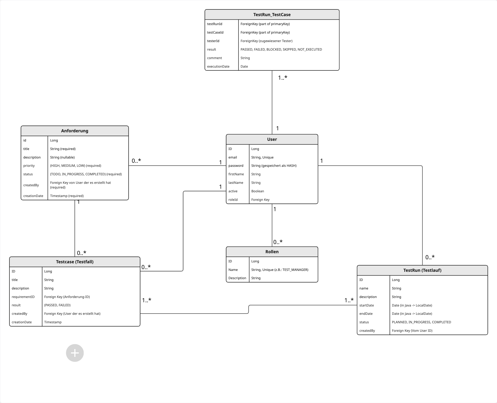
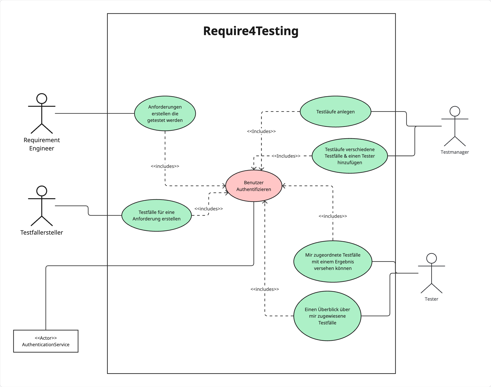

# Require4Testing

## About the Project

Require4Testing is a web application for organizing and managing manual application testing. This project aims to streamline the process of planning, creating, and performing tests based on software requirements.

The application is built with Spring Modulith, providing a modular and maintainable backend architecture, and is containerized using Docker for easy deployment.

## Problem Statement

In software development projects, manual testing is often a crucial part of the quality assurance process. However, organizing test cases, assigning testers, and tracking test results can become complicated and inefficient without proper tooling. Require4Testing addresses this challenge by providing a structured platform where:

- Requirements Engineers can document the requirements to be tested
- Test Case creators can define specific test cases for each requirement
- Test Managers can organize test runs and assign test cases to testers
- Testers can record and report test results in a centralized system

## Project Goals

The primary goals of this application are to:

1. Simplify the management of testing activities
2. Create a clear connection between requirements and test cases
3. Provide visibility into testing progress and results
4. Streamline the workflow between different roles in the testing process

## Features (User Stories)

The following user stories describe the core functionality of Require4Testing:

1. **MUST**: As a Requirements Engineer, I want to create testable requirements.
2. **MUST**: As a Test Manager, I want to create test runs.
3. **MUST**: As a Test Case Creator, I want to create test cases for specific requirements.
4. **SHOULD**: As a Test Manager, I want to assign different test cases and a tester to a test run.
5. **SHOULD**: As a Tester, I want to provide results for test cases assigned to me.
6. **COULD**: As a Tester, I want to have an overview of test cases assigned to me.
7. **COULD**: As a Test Manager, I want an overview of the status of all test executions.
8. **COULD**: As a Test Case Creator, I want to capture individual test steps for test cases.

## System Architecture

### Architecture Overview

The application follows a modular monolith architecture using Spring Modulith, which provides:

- Clear module boundaries
- Explicit dependencies between modules
- Improved maintainability and testability

The main modules include:
- **Authentication**: Handles user authentication and security
- **Requirements**: Manages requirement creation and tracking
- **TestCase**: Manages test case creation and linking to requirements
- **TestRun**: Handles test run management and execution
- **Users**: Manages user profiles and roles

### Data Model



The data model consists of the following key entities:

- **Anforderung (Requirement)**: Represents a requirement that needs to be tested
- **TestCase**: Specific test case linked to a requirement
- **TestRun**: A collection of test cases to be executed
- **User**: System users with different roles (Requirement Engineer, Test Creator, Test Manager, Tester)
- **Rollen (Roles)**: User roles that determine permissions
- **TestRun_TestCase**: Maps test cases to test runs and captures execution results

### Use Case Model



The use case diagram illustrates the interactions between different user roles and the system:

- **Requirement Engineer**: Creates requirements that need to be tested
- **Test Case Creator**: Creates test cases for specific requirements
- **Test Manager**: Creates test runs and assigns test cases and testers
- **Tester**: Executes assigned test cases and records results

All users authenticate through a central authentication service.

## Technology Stack

This project is built using:

- Spring Modulith for modular, well-structured backend architecture
- JPA with Hibernate as the persistence provider
- Postgresql for the relational database
- Docker and Docker Compose for containerization

## Development Status

This project is currently in the prototype phase, implementing the core functionality for the first sprint.

## Getting Started

### Prerequisites

- Java Development Kit (JDK) 17+
- Docker and Docker Compose
- Maven
- Git

### Installation

1. Clone the repository
   ```
   git clone https://github.com/yourusername/Require4Testing.git
   ```

2. Navigate to the project directory
   ```
   cd Require4Testing
   ```

3. Build the project
   ```
   mvn clean install
   ```

4. Run with Docker Compose
   ```
   docker-compose up -d
   ```

This will start the containerized backend application along with a MySQL database container. The application will be accessible at `http://localhost:8080`.

### Docker Configuration

The project includes the following Docker-related files:

- `Dockerfile`: Defines the container image for the Spring Modulith application
- `docker-compose.yml`: Orchestrates the application and database containers

The Docker setup ensures that the application is:
- Easy to deploy
- Consistent across different environments
- Properly connected to the MySQL database

## Acknowledgements

This project was developed as part of a case study for the IPWA02-01 course at IU International University.
